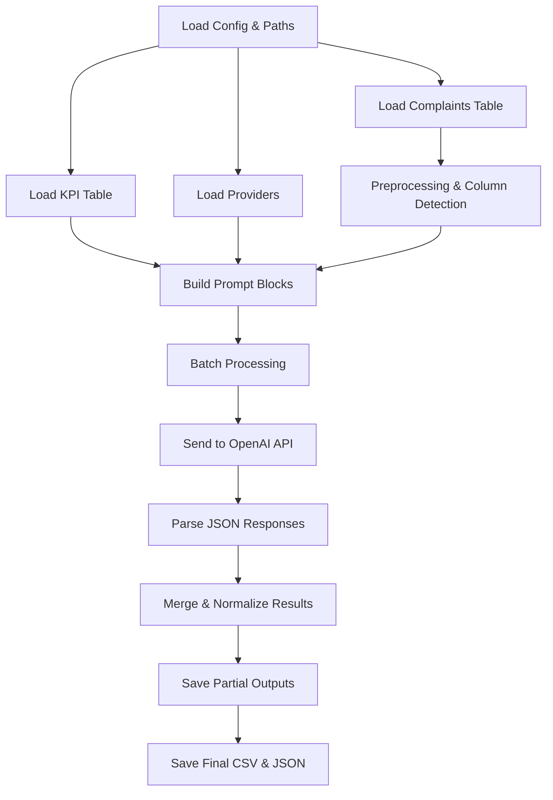

# Complaint KPI Analyzer

This repository contains a fully automated system for analyzing telecom customer complaints and mapping them to relevant KPIs (Key Performance Indicators) using LLM-based text analysis. The system loads complaint data, KPI definitions, and provider lists, processes them in batches, and produces structured JSON and CSV outputs.

The goal of this project is to help automate quality monitoring, categorize issues, and provide explanations and confidence scores for each detected KPI.

---

## 🚀 **Overview**

The system takes three main inputs:

* **Complaints table** — `.csv`, `.xlsx`, or `.ods` with complaint IDs and text.
* **KPI definitions** — table with KPI IDs, names, and descriptions.
* **Providers list** — optional list of telecom operators.

Using OpenAI's language model, the system:

1. Reads complaints in batches.
2. Builds optimized prompts.
3. Sends them to the OpenAI API.
4. Parses the JSON outputs.
5. Combines and saves results incrementally.

Output files are stored in the `outputs/` directory:

* `analysis_partial_*.csv` — partial results after each batch.
* `complaint_kpi_analysis_*.csv` — final dataset.
* `complaint_kpi_analysis_*.json` — final structured JSON.

---

## 📂 **Project Structure**

```
📁 ICTA
 ├── complaint_analyzer.py        # Main analyzer class
 ├── run_analysis.py              # Entry point for running analysis
 ├── config.py                    # Configuration (file paths, default settings)
 ├── requirements.txt             # Dependencies
 ├── outputs/                     # Generated results (.csv, .json)
 ├── data/                        # Input datasets (complaints, KPIs, providers)
 ├── .gitignore
 └── README.md
```

---

## 🧠 **Processing Flow**

Below is the architecture diagram (Mermaid format). GitHub renders it automatically.



---

## 📘 **How It Works**

### **1. Load Input Tables**

The analyzer supports:

* `.csv`
* `.xlsx` / `.xls`
* `.ods` (with fallback via `ezodf`)

### **2. Auto-Detect Columns**

The script tries multiple column name variations to detect:

* Complaint ID
* Complaint text

### **3. Build Prompt**

For each batch:

* Includes provider list
* Includes KPI list
* Includes complaints
* Requests JSON array output only

### **4. Send to OpenAI**

Uses batch-size defined in `config.py`.
Works in parallel if enabled.

### **5. Parse JSON**

Extracts KPI reasoning, operator identification, and maps them correctly to complaint IDs.

### **6. Save Results**

Intermediate CSV/JSON files are continuously saved so no data is lost.

---

## ▶️ **How to Run**

### **1. Install dependencies**

```
pip install -r requirements.txt
```

### **2. Add API key**

Create `.env` file:

```
OPENAI_API_KEY=your_key_here
```

### **3. Run analyzer**


Results appear in `outputs/`.

---

## 🔐 Security Notes

* `.env` is ignored by `.gitignore`.
* API key is **not** included in the repository.
* Sensitive files are protected from accidental push.


